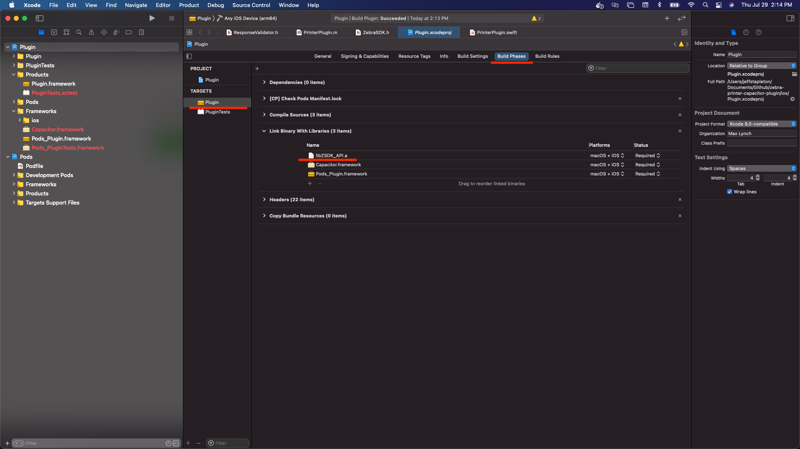
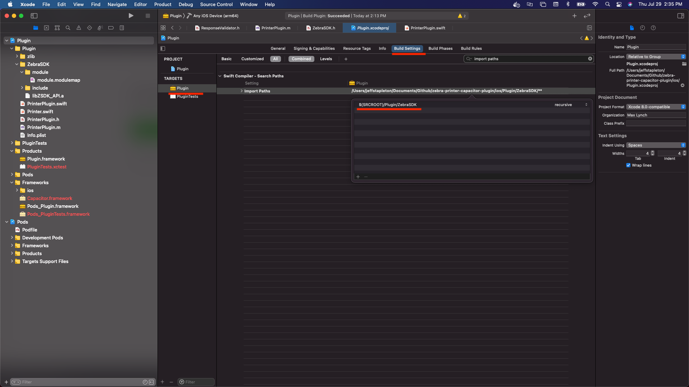

# zebra-printer-capacitor-plugin

Capacitor plugin for the Zebra printer SDK. This plugin was developed with the help of mainly two online tutorials:

[Creating Capacitor Plugins](https://capacitorjs.com/docs/v3/plugins/creating-plugins)

[Using a C Library inside a Swift framework](https://medium.com/swift-and-ios-writing/using-a-c-library-inside-a-swift-framework-d041d7b701d9)

## Setup

As of now, this plugin only supports iOS. Before we can begin development we must run the following commands

```bash
npm run build
cd ios/
pod install
```

## Testing

To locally test the plugin you can link it to your application by running the following command:

```bash
npm install ../zebra-printer-capacitor-plugin
```
<br/>

> **_NOTE:_** The path to the plugin, is the path to the directory that contains the plugin's `package.json`

<br/>

Finally to make your application aware of plugin run the following command:

```bash
npx cap sync 
```

The plugin can also be easily unlinked by simply running:

```bash
npm uninstall zebra-printer-capacitor-plugin
```

## iOS Development

to begin development simply open `ios/Plugin.xcworkspace` in Xcode

To add new functionality to the plugin in you will have to first define your methods signature in the `src/definitions.ts`

```ts
export interface PrinterPlugin {
  echo(options: { value: string }): Promise<{ value: string }>;
  print(options: { value: string }): Promise<{ value: string }>;
}
```

Regardless that this plugin is only for iOS you will have to implement the new method in the `src/web.ts`

```ts
async print(options: { value: string }): Promise<{ value: string }> {
    throw new Error('Method not implemented.' + options);
}
```

There is one more place where we need to declare the new method's signature, in the `ios/Plugin/PrinterPlugin.m`

```m
CAP_PLUGIN(PrinterPlugin, "Printer",
           CAP_PLUGIN_METHOD(echo, CAPPluginReturnPromise);
           CAP_PLUGIN_METHOD(print, CAPPluginReturnPromise);
)
```

With that done, you can finally implement the method's functionality in the `ios/Plugin/PrinterPlugin.swift`

## Including Static Libraries

This plugin is mainly a wrapper for the ZebraPrinter SDK. The SDK was implemented in objective-c so getting it to play nice with swift was not easy. Below I will include a quick summary as to how the static library is implemented and packaged.

Since the Zebra SDK was written in objective-c we can't import it's headers into our swift framework and bridging headers are not supported in swift frameworks so we were left with one option, that is to create a module. This module can be found `ios/Plugin/ZebraSDK` it is import to provide both the static library and all the heaeder files.

All the functionality of the SDK is contained within the `ios/Plugin/ZebraSDK/libZSDK_API.a` static library. We will need to configure the Plugin to be aware of this library. In Xcode open the Plugin.xcodeproj and go the "Build Phases" tab. Under the "Link Binary With Library" section add the reference `ios/Plugin/ZebraSDK/libZSDK_API.a`. 

<br/>

> **_NOTE:_**  This will also add the reference to "Frameworks, Libraries, and Embedded Content" under the "General" tab.

<br/>



Next we will need to create a `.modulemap` to define the module so it can be imported for use in the plugin. 

```modulemap
module ZebraSDK [system][extern_c] {
    header "../include/ZebraSDK.h"
    link "z"
    export *
}
```

Here we are importing the main header `ios/Plugin/ZebraSDK/include/ZebraSDK.h` within this header is the imports of all the other c headers we are using in the plugin. It's also important to 

<br/>

> **_NOTE:_** We also need export everything so that the consuming plugin will be aware of all the header files. So don't forget the `export *`

<br/>

With that done there is just one final step before we can import our module for use in the plugin. In Xcode open the Plugin.xcodeproj and go the "Build Settings" tab. under the "Swift Compiler - Search Paths" find the setting "Import Paths" set that value to `${SRCROOT}/Plugin/ZebraSDK`. Now when Xcode is trying to resolve module imports in swift it will also check this location and find our module.



Thats it! We are now ready to import the module into a `.swift` file and call functions from the SDK:

```swift
import ZebraSDK

@objc(PrinterPlugin)
public class PrinterPlugin: CAPPlugin {

    // ...

    @objc func print(_ call: CAPPluginCall) {
        let value = call.getString("value") ?? ""
        let connection = TcpPrinterConnection.init(address: "10.200.004.060", andWithPort:6101);
         
        // ...

        call.resolve([
            "success": true
        ])
    }
```

## CocoaPods

The above instructions will have gotten you to a place where you can work on and develop the plugin locally. But we still need to cofigure the plugin so when it's install into an application the compiler can find our module. 

Capacitor uses Cocoapods when it comes to installing the plugin, we will need to configure the `ZebraPrinterCapacitorPlugin.podspec` file with all our configurations.

The first change we need to make is the tell cocoapods to grab our `.modulemap` and `.a` files when bundling the source files:
```podspec
s.source_files = 'ios/Plugin/**/*.{swift,h,m,c,cc,mm,cpp,modulemap,a}'
```

Second we need to tell cocoapods that we are also providing a third party library. This configuration change will tell Xcode to link the libZSDK_API.a binaries:
```podspec
s.ios.vendored_libraries = 'ios/Plugin/ZebraSDK/libZSDK_API.a'
```

Next we need to configure the ZebraPrinterCapacitorPlugin project pod in Xcode and tell it where to find our module. This sets the "Import Paths" setting in Xcode:
```podspec
s.pod_target_xcconfig = {'SWIFT_INCLUDE_PATHS' => '$(SRCROOT)/../../../node_modules/zebra-printer-capacitor-plugin/ios/Plugin/ZebraSDK/**'}
```

Finally we need to tell cocoapods to preserve the path to our `.modulemap` file:
```podspec
s.preserve_paths = 'ios/Plugin/ZebraSDK/module/module.modulemap'
```